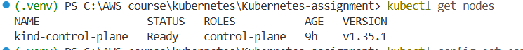
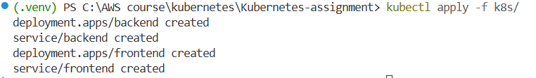
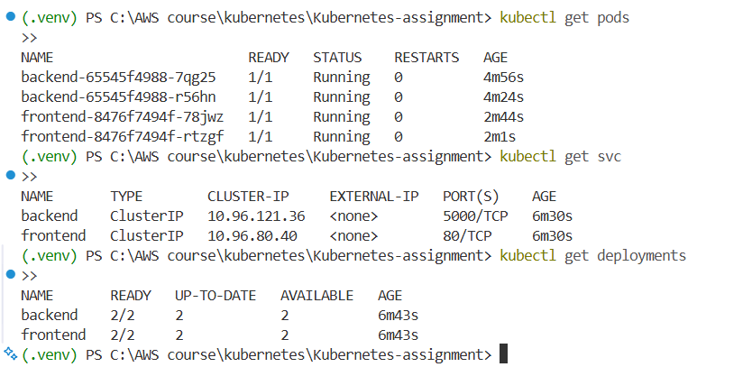
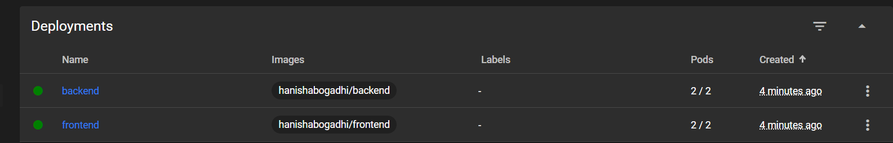
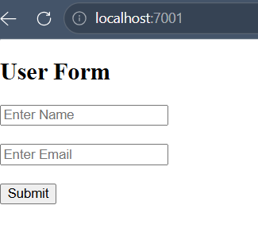
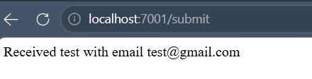

# Kubernetes Deployment of Flask Backend & Express Frontend

## Overview

This project demonstrates deployment of a full-stack application on Kubernetes.

* Frontend: Express.js (EJS) – Port 3000
* Backend: Flask API – Port 5000
* Cluster: Kind (used instead of Minikube)

> Note: Kind (Kubernetes in Docker) was used as a lightweight alternative to Minikube.

---

## Steps to Run

### 1. Create Cluster

```bash
kind create cluster
kubectl get nodes
```




---

### 2. Build & Push Images

```bash
docker build -t hanishabogadhi/backend ./backend
docker push hanishabogadhi/backend

docker build -t hanishabogadhi/frontend ./frontend
docker push hanishabogadhi/frontend
```


---

### 3. Deploy to Kubernetes

```bash
kubectl apply -f k8s/backend.yaml
kubectl apply -f k8s/frontend.yaml
```




---

### 4. Verify Resources

```bash
kubectl get pods
kubectl get svc
kubectl get deployments
```





---

### 5. Access Application

```bash
kubectl port-forward svc/frontend 7001:80
```

Open: http://localhost:7001







---

## Service Communication

Frontend calls backend using:

```
http://backend:5000/submit
```

---

## Conclusion

The application was successfully deployed on Kubernetes using Kind.
This demonstrates container orchestration and service-to-service communication.
